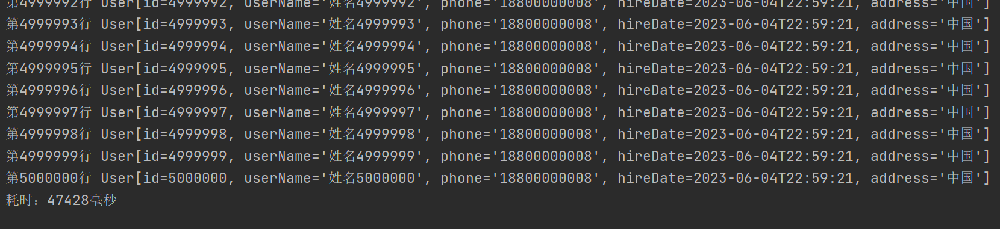

## 百万数据导入

### 概述

使用POI基于事件模式解析案例提供的Excel文件


### 问题说明

**用户模式：**使用用户模式加载并读取Excel时，是通过一次性的将所有数据加载到内存中再去解析每个单元格内容。当Excel数据量较大时，由于不同的运行环境可能会造成内存不足甚至OOM异常。


```java
package mao;

import org.apache.poi.xssf.usermodel.XSSFSheet;
import org.apache.poi.xssf.usermodel.XSSFWorkbook;

import java.io.IOException;

/**
 * Project name(项目名称)：java报表_poi百万数据导入
 * Package(包名): mao
 * Class(类名): Test1
 * Author(作者）: mao
 * Author QQ：1296193245
 * GitHub：https://github.com/maomao124/
 * Date(创建日期)： 2023/6/5
 * Time(创建时间)： 23:54
 * Version(版本): 1.0
 * Description(描述)： 用户模式导入
 */

public class Test1
{
    public static void main(String[] args) throws IOException
    {
        XSSFWorkbook workbook = new XSSFWorkbook("./out.xlsx");
        XSSFSheet sheet = workbook.getSheetAt(0);
    }
}
```


会直接报内存溢出的错误：

```sh
Exception in thread "main" java.lang.OutOfMemoryError: Java heap space
	at java.util.Arrays.copyOf(Arrays.java:3181)
	at java.util.ArrayList.grow(ArrayList.java:267)
	at java.util.ArrayList.ensureExplicitCapacity(ArrayList.java:241)
	at java.util.ArrayList.ensureCapacityInternal(ArrayList.java:233)
	at java.util.ArrayList.add(ArrayList.java:464)
	at org.apache.xmlbeans.impl.store.Xobj.find_all_element_users(Xobj.java:2098)
	at org.openxmlformats.schemas.spreadsheetml.x2006.main.impl.CTSheetDataImpl.getRowArray(Unknown Source)
	at org.apache.poi.xssf.usermodel.XSSFSheet.initRows(XSSFSheet.java:269)
	at org.apache.poi.xssf.usermodel.XSSFSheet.read(XSSFSheet.java:233)
	at org.apache.poi.xssf.usermodel.XSSFSheet.onDocumentRead(XSSFSheet.java:220)
	at org.apache.poi.xssf.usermodel.XSSFWorkbook.parseSheet(XSSFWorkbook.java:452)
	at org.apache.poi.xssf.usermodel.XSSFWorkbook.onDocumentRead(XSSFWorkbook.java:417)
	at org.apache.poi.ooxml.POIXMLDocument.load(POIXMLDocument.java:184)
	at org.apache.poi.xssf.usermodel.XSSFWorkbook.<init>(XSSFWorkbook.java:286)
	at org.apache.poi.xssf.usermodel.XSSFWorkbook.<init>(XSSFWorkbook.java:340)
	at mao.Test1.main(Test1.java:25)
```


### 解决方案分析

可以使用事件模式

**事件模式：**它逐行扫描文档，一边扫描一边解析。由于应用程序只是在读取数据时检查数据，因此不需要将数据存储在内存中，这对于大型文档的解析是个巨大优势。


### 步骤分析

1. 设置POI的事件模式

   * 根据Excel获取文件流
   * 根据文件流创建OPCPackage  用来组合读取到的xml 组合出来的数据占用的空间更小
   * 创建XSSFReader对象

2. Sax解析

   * 自定义Sheet处理器
   * 创建Sax的XmlReader对象
   * 设置Sheet的事件处理器
   * 逐行读取

   

   

### 实现

SheetHandler

```java
package mao.handler;

import mao.entity.User;
import org.apache.poi.xssf.eventusermodel.XSSFSheetXMLHandler;
import org.apache.poi.xssf.usermodel.XSSFComment;

import java.time.LocalDateTime;

/**
 * Project name(项目名称)：java报表_poi百万数据导入
 * Package(包名): mao.handler
 * Class(类名): SheetHandler
 * Author(作者）: mao
 * Author QQ：1296193245
 * GitHub：https://github.com/maomao124/
 * Date(创建日期)： 2023/6/6
 * Time(创建时间)： 0:08
 * Version(版本): 1.0
 * Description(描述)： 无
 */

public class SheetHandler implements XSSFSheetXMLHandler.SheetContentsHandler
{

    private long rowIndex = 1;

    /**
     * 用户对象，线程安全
     */
    private User user = null;

    /**
     * 开始行
     *
     * @param i 行号
     */
    @Override
    public void startRow(int i)
    {
        if (i == 0)
        {
            user = null;
        }
        else
        {
            user = new User();
        }
    }

    /**
     * 结束行
     *
     * @param i 行号
     */
    @Override
    public void endRow(int i)
    {
        if (i != 0)
        {
            //打印user
            //todo：
            System.out.println("第" + rowIndex + "行 " + user);
            rowIndex++;
        }
    }

    /**
     * 单元格
     *
     * @param s           String ,单元格名称,例如 A  B  C
     * @param s1          String ， 单元格的值
     * @param xssfComment xssf评论
     */
    @Override
    public void cell(String s, String s1, XSSFComment xssfComment)
    {
        if (user != null)
        {
            String letter = s.substring(0, 1);
            switch (letter)
            {
                case "A":
                {
                    user.setId(Long.parseLong(s1));
                    break;
                }
                case "B":
                {
                    user.setUserName(s1);
                    break;
                }
                case "C":
                {
                    user.setPhone(s1);
                    break;
                }
                case "D":
                {
                    user.setHireDate(LocalDateTime.parse(s1));
                    break;
                }
                case "E":
                {
                    user.setAddress(s1);
                    break;
                }
            }
        }
    }
}
```


```java
package mao;

import mao.handler.SheetHandler;
import org.apache.poi.openxml4j.exceptions.InvalidFormatException;
import org.apache.poi.openxml4j.exceptions.OpenXML4JException;
import org.apache.poi.openxml4j.opc.OPCPackage;
import org.apache.poi.openxml4j.opc.PackageAccess;
import org.apache.poi.xssf.eventusermodel.XSSFReader;
import org.apache.poi.xssf.eventusermodel.XSSFSheetXMLHandler;
import org.apache.poi.xssf.model.SharedStringsTable;
import org.apache.poi.xssf.model.StylesTable;
import org.xml.sax.InputSource;
import org.xml.sax.SAXException;
import org.xml.sax.XMLReader;
import org.xml.sax.helpers.XMLReaderFactory;

import java.io.IOException;
import java.io.InputStream;

/**
 * Project name(项目名称)：java报表_poi百万数据导入
 * Package(包名): mao
 * Class(类名): Test2
 * Author(作者）: mao
 * Author QQ：1296193245
 * GitHub：https://github.com/maomao124/
 * Date(创建日期)： 2023/6/6
 * Time(创建时间)： 0:06
 * Version(版本): 1.0
 * Description(描述)： 无
 */

public class Test2
{
    public static void main(String[] args) throws OpenXML4JException, IOException, SAXException
    {
        //开始时间
        long start = System.currentTimeMillis();
        //根据Excel获取OPCPackage对象
        OPCPackage opcPackage = OPCPackage.open("./out.xlsx", PackageAccess.READ);
        //创建XSSFReader对象
        XSSFReader xssfReader = new XSSFReader(opcPackage);
        //获取SharedStringsTable对象
        SharedStringsTable sharedStringsTable = xssfReader.getSharedStringsTable();
        //获取StylesTable对象
        StylesTable stylesTable = xssfReader.getStylesTable();
        //创建XMLReader
        XMLReader xmlReader = XMLReaderFactory.createXMLReader();
        xmlReader.setContentHandler(new XSSFSheetXMLHandler(stylesTable, sharedStringsTable, new SheetHandler(), false));
        XSSFReader.SheetIterator sheets = (XSSFReader.SheetIterator) xssfReader.getSheetsData();
        while (sheets.hasNext())
        {
            //读取数据
            InputStream inputStream = sheets.next();
            InputSource sheetSource = new InputSource(inputStream);
            try
            {
                //解析
                xmlReader.parse(sheetSource);
            }
            finally
            {
                inputStream.close();
            }
        }
        //关闭
        opcPackage.close();
        long end = System.currentTimeMillis();
        //打印语句加了悲观锁，会影响性能
        System.out.println("耗时：" + (end - start) + "毫秒");
    }
}
```


### 测试结果




